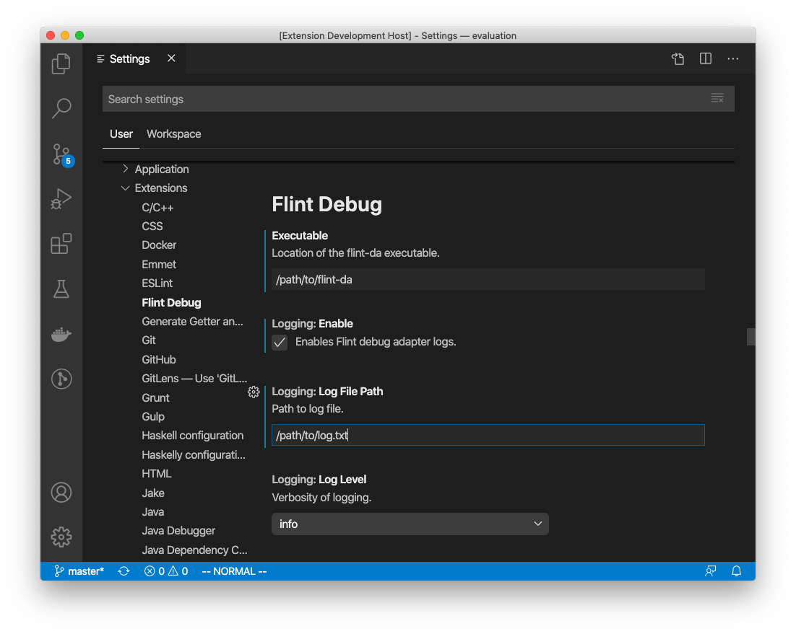

# Flint Debug Extension for VS Code

## Configuration

This extension must be configured correctly before it can be used properly!

1. Ensure you have the Flint debug adapter `flint-da` installed correctly somewhere in your system.

```bash
$ flint-da --help
Usage:

    $ flint-da

Options:
    --log-file [default: ] - File to write logs to
    --log-level [default: ] - Logging level
    --rpc-url [default: http://localhost:8545] - Ethereum client RPC URL
    --input [default: ] - Input, defaults to stdin
    --output [default: ] - Output, defaults to stdout
```

2. Go to VS Code settings and set **Executable** to the *full path* of `flint-da`.

