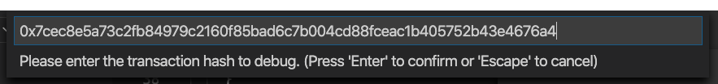

# Flint Debug Extension for VS Code

[](https://marketplace.visualstudio.com/items?itemName=noellee-doc.flint-debug)

Visual Studio Code debugger extension for [Flint](https://github.com/flintlang/flint).

## Configuration

This extension must be configured correctly before it can be used properly!

1. Ensure you have the Flint debug adapter `flint-da` installed correctly somewhere in your system.

```bash
$ flint-da --help
Usage:

    $ flint-da

Options:
    --log-file [default: ] - File to write logs to
    --log-level [default: ] - Logging level
    --rpc-url [default: http://localhost:8545] - Ethereum client RPC URL
    --input [default: ] - Input, defaults to stdin
    --output [default: ] - Output, defaults to stdout
```

2. Go to VS Code settings and set **Executable** to the *full path* of `flint-da`.


## Usage

1. Create a `launch.json` file with the *Flint Debug* default configuration.

2. The configuration should look like this in your `launch.json`.

```json
{
    "type": "flint",
    "request": "launch",
    "name": "Ask for transaction hash",
    "txHash": "${command:AskForTransactionHash}",
    "artifactDirectory": "${workspaceFolder}/bin",
    "rpcUrl": "http://localhost:8545"
}
```

3. Change the `artifactDirectory` and `rpcUrl` if your setup is different from the default values.

4. Run the configuration. It should prompt you for a transaction hash to debug.



5. Start debugging!